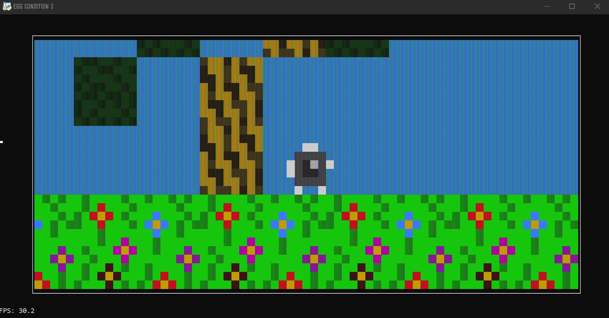

# cond_engine
A text-based graphics engine built in Python, without external libraries.
For now it is only in Italian, but I will soon translate the code into English. 

To use the code, simply import the [main file](cond_engine.py) and use the various classes/functions as in the [example](example.py). 
This engine can be used in many types of projects (videogames, simulations, etc...).
For example I used it for [Egg Condition 3](https://nalio.itch.io/) 🥚🥚🥚

This code is open source and provides a graphical interface without the need to install external libraries.
Please do not modify the engine code.

*NALIo*
